# Give in good hands - donation app

### Python web application prepared to maintain database with functionalities typical for logistic website

## Table of contents

* [General info](#general-info)
* [Technologies](#technologies)
* [Screenshots](#screenshots)
* [Status](#status)

## General info

The app was created as my one of many individual projects prepared as part of Portfolio Lab at Coders Lab after 3 months Python Developer course in Coders Lab IT school. The main aim was to sum up and develope skills in Django, JavaScript and many others. The subject project was prepared under the supervision of a dedicated mentor.

The 'Give in good hands' application allows:

- register for new user using email as username (by customizing user model), app verifies whether email is unique, new user is not active, after registration new user gets email message with unique link to activate user account (SMTP method via gmail) - [link](./img_readme/10_registration_email_with_activation_link.png)
- 
- AJAX, jQuery and JsonRequest in practice submit action via JavaScript to Django
- contact form with emailing to users with admin status (SMTP method)
- custom user model and login by email not my username
- activation user profile via personal unique link send by email to a new user (SMTP method)
- custom delete method preventing deletion of the last admin
- custom password unique validation methods
- set of functionalities as 'forgot your password', 'set new password' and following
- aggregate and annotate methods in practice
and many others

## Technologies

* Bootstrap 4
* Python 3.8.3
* Django
* JavaScript (AJAX, jQuery, JSON)
* pytest-django, psycopq2-binary, pytz, six, envfile
* postgres
* IDE (PyCharm)

The application bases on the database created in the postgres. The app was created in Django and JS with many different technics applied: [AJAX, jQuery and JsonRequest](./img_readme/11_AJAX_JS_submit_action.png) in practice [submit action via JavaScript to Django](./img_readme/14_summary_Js_form.png), [contact form with emailing to users with admin status (SMTP method)](./img_readme/4_contact_form.png), [custom user model](./img_readme/5_register_form.png) and [login by email not my username](./img_readme/6_login_form.png), activation user profile via personal [unique link send by email to a new user (SMTP method)](./img_readme/10_registration_email_with_activation_link.png), custom delete method preventing deletion of the last admin, set of functionalities as 'forgot your password', ['set new password'](./img_readme/8_password_reset_form.png) and following, [aggregate and annotate methods in practice](./img_readme/2_aggregate_annotate.png), creating forms, models and views (generic and straight classic views and generic forms with applied widgets), custom password unique validation methods.

## Screenshots

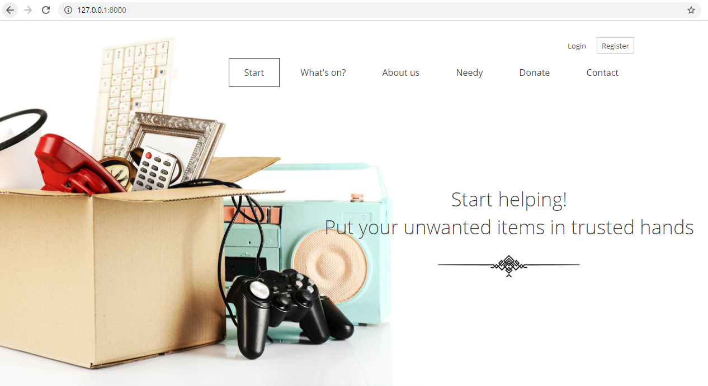
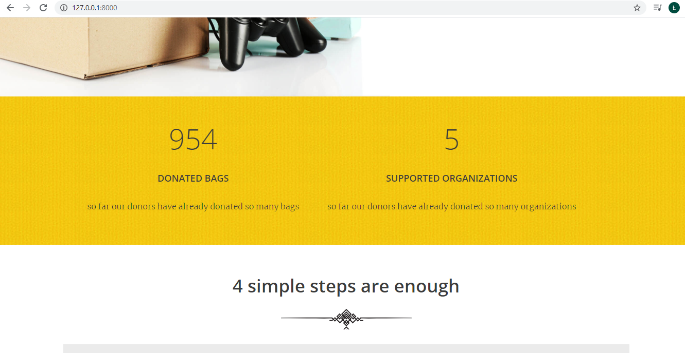
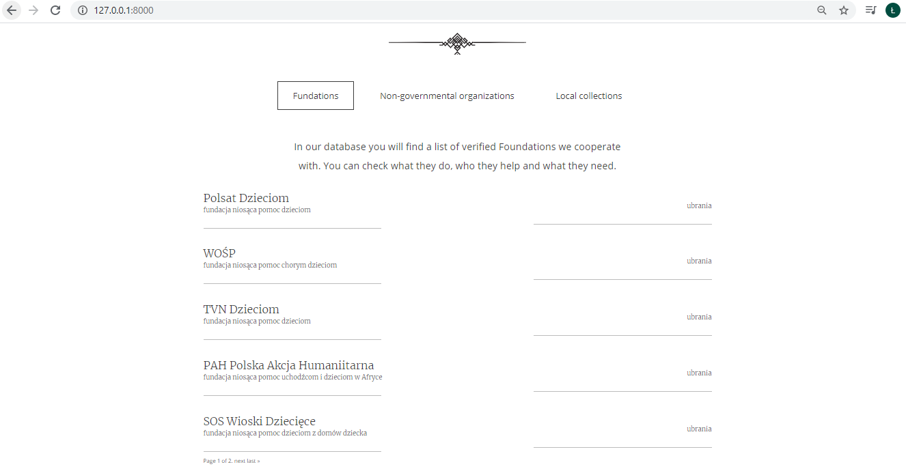
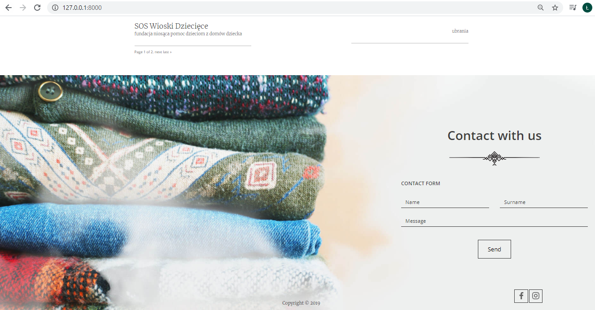
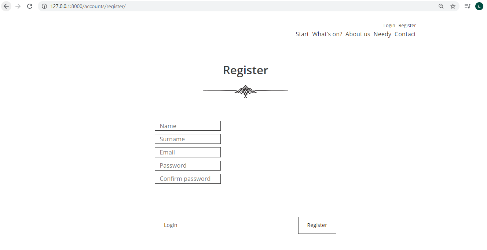
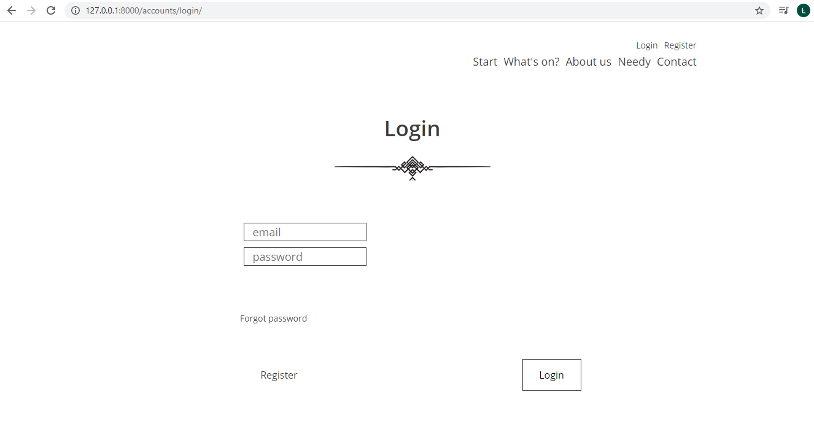
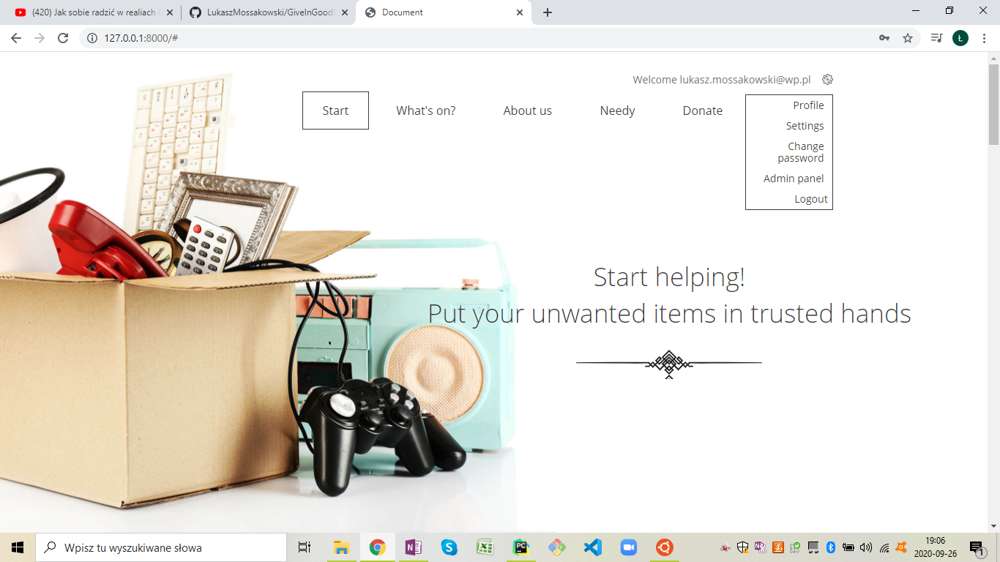
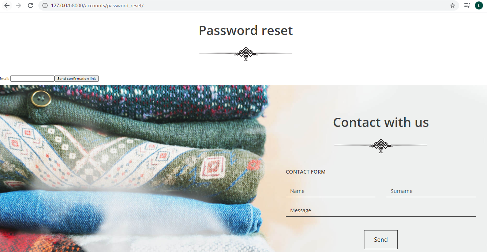
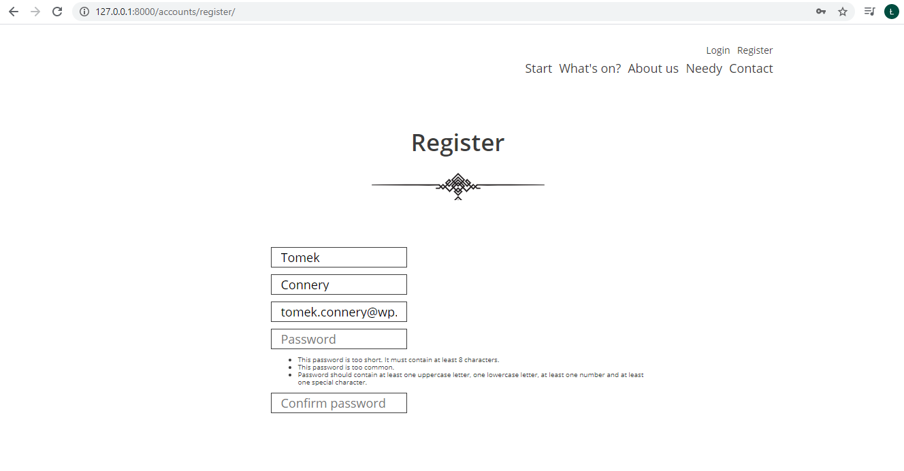
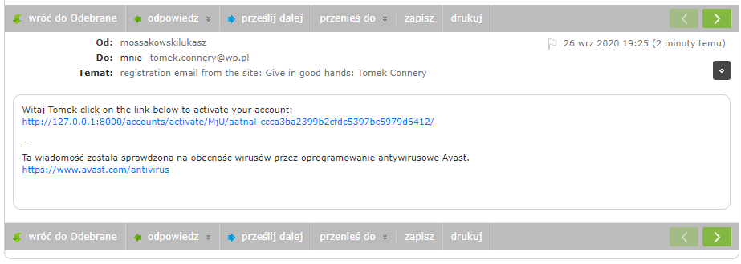
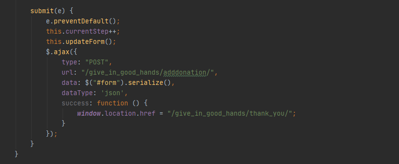
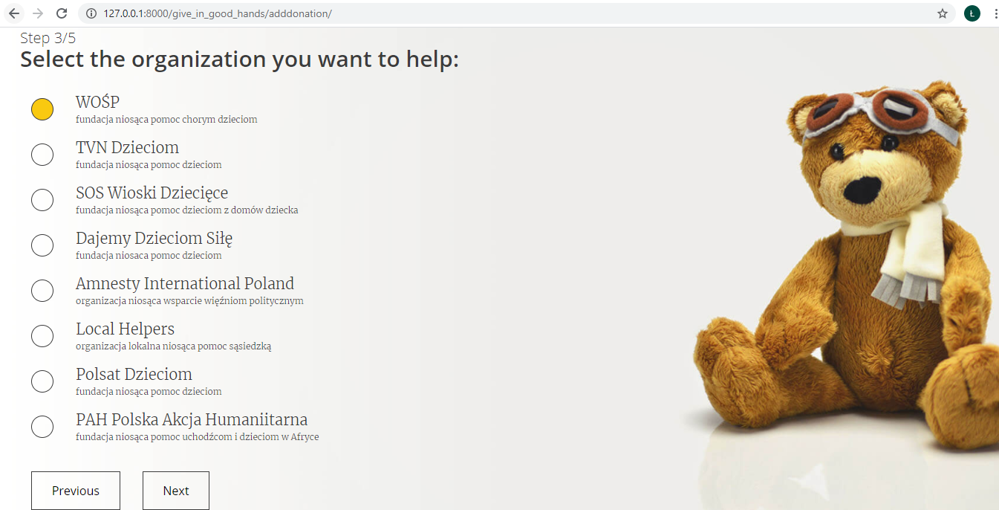
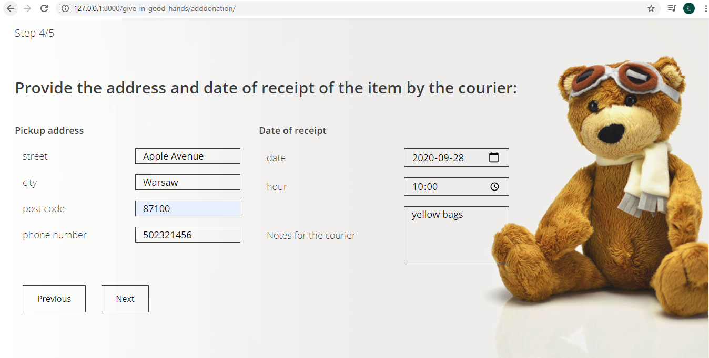
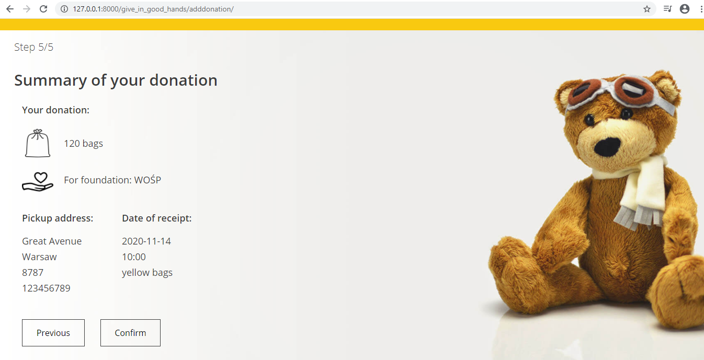
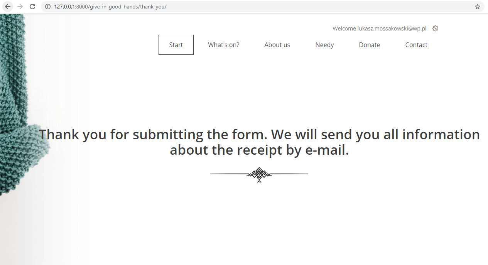

## Status

The project is _in progress_. The next step in planned development of the application is to develop JS functionality :)
